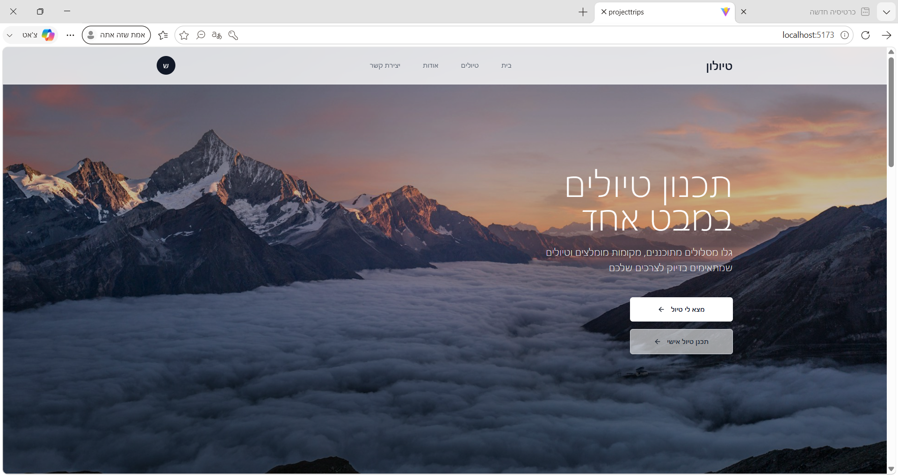
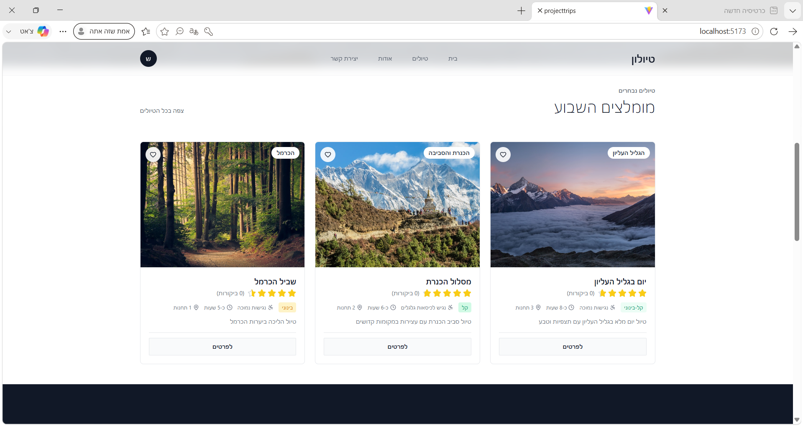
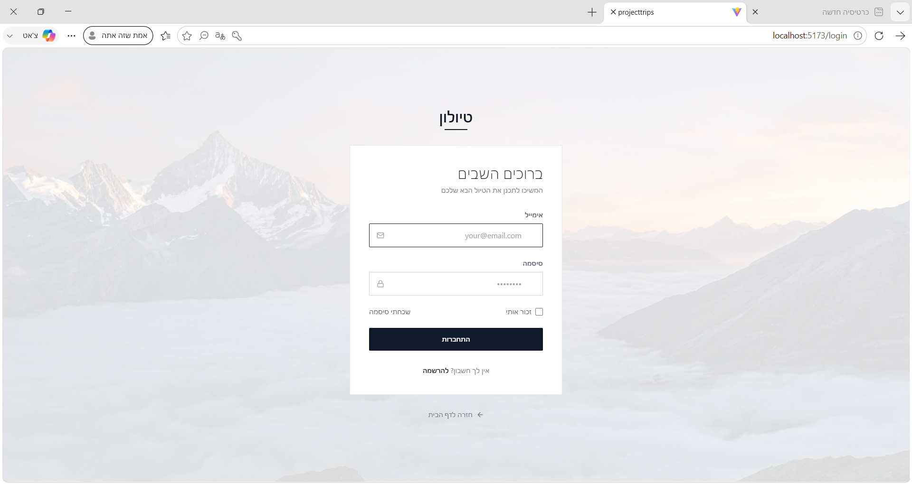
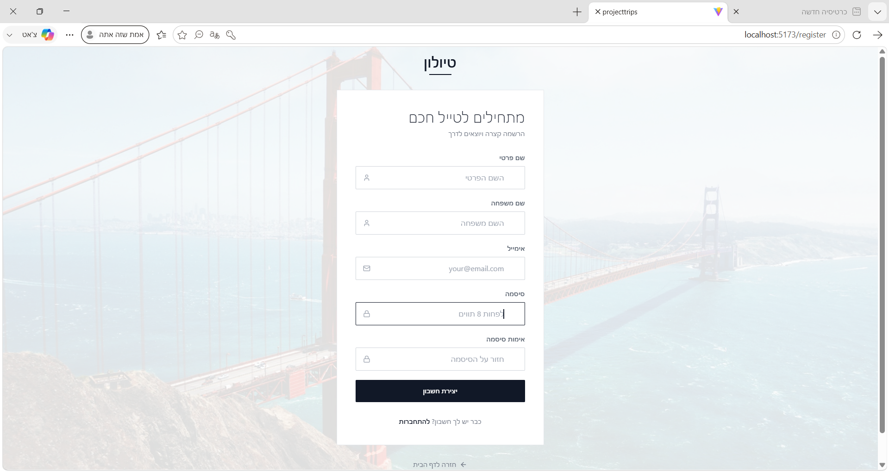
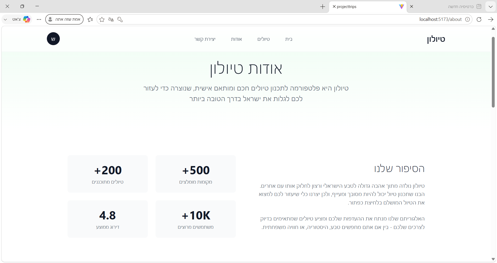
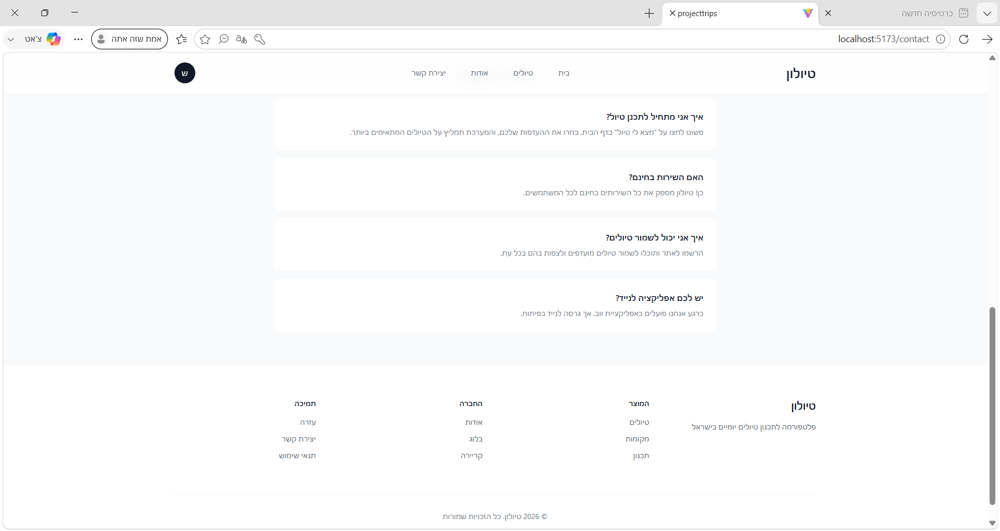

<div align="center">
  <h1>🏔️ FindPlanTripIsrael</h1>
  <p><strong>Plan & Discover the Perfect Trip Across Israel</strong></p>
  <p>
    
    
    
    
    
  </p>
</div>

---

## 📖 About

**FindPlanTripIsrael** is a full-stack web application that lets users **browse, discover, and build custom day trips** across Israel. Whether you're looking for a curated route or want to craft your own adventure from scratch — this app has you covered.

Built with a modern **React + TypeScript** frontend and a clean layered **ASP.NET Core 8** backend, it features JWT authentication, interactive trip planning, rich place & route browsing, reviews, ratings, and a fully responsive UI.

---

## ✨ Features

| Category | Details |
|----------|---------|
| **🔍 Discover** | Browse places, routes, and curated day trips by region, type, difficulty, and more |
| **🧩 Trip Planner** | Interactive wizard — pick places & routes, order them, choose travel mode, see duration & distance |
| **👤 User Area** | Personal dashboard, profile management, change password, track your created trips |
| **🔐 Auth** | JWT-based registration / login with refresh tokens, role-based access (Admin / User) |
| **⭐ Reviews & Ratings** | Rate and review places, routes, and day trips |
| **📊 Smart Filters** | Filter by region, type, difficulty, accessibility, price, weather preferences |
| **🖼️ Rich Media** | Image galleries for places and trips |
| **📱 Responsive** | Fully adaptive layout — mobile, tablet, desktop |
| **🔒 Security** | Rate limiting on reviews, BCrypt password hashing, CORS policy |

---

## 🛠️ Tech Stack

### Frontend
| Technology | Purpose |
|------------|---------|
| **React 19** | UI framework |
| **TypeScript 5.9** | Type safety |
| **Vite 7** | Build tool & dev server |
| **Redux Toolkit** | State management |
| **React Router 7** | Client-side routing |
| **Tailwind CSS 3** | Utility-first styling |
| **Axios** | HTTP client with interceptors |
| **Lucide React / React Icons** | Icon libraries |

### Backend
| Technology | Purpose |
|------------|---------|
| **ASP.NET Core 8** | Web API framework |
| **Entity Framework Core 9** | ORM |
| **SQL Server** | Database |
| **JWT Bearer** | Authentication |
| **AutoMapper** | Object mapping |
| **BCrypt.Net** | Password hashing |
| **Swagger / Swashbuckle** | API docs |
| **Rate Limiting** | Review spam protection |

### Architecture
```
Controller → Service → Repository → EF Core → SQL Server
```

---

## 📁 Project Structure

```
FindPlanTripIsrael/
├── client/                        # React Frontend
│   ├── src/
│   │   ├── auth/                  # Auth context, guards, utils
│   │   ├── component/             # Reusable components
│   │   ├── hooks/                 # Custom hooks
│   │   ├── layouts/               # Layout components
│   │   ├── pages/                 # Page components
│   │   │   ├── HomePage.tsx
│   │   │   ├── DayTripsPage.tsx   # Browse trips
│   │   │   ├── TripDetailsPage.tsx
│   │   │   ├── TripPlannerWizard.tsx  # Interactive planner
│   │   │   ├── PlanningResultPage.tsx
│   │   │   ├── PersonalArea.tsx   # User dashboard
│   │   │   ├── LoginPage.tsx
│   │   │   ├── RegisterPage.tsx
│   │   │   ├── AboutPage.tsx
│   │   │   └── ContactPage.tsx
│   │   ├── redux/                 # Redux store & slices
│   │   ├── routes/                # Router config
│   │   ├── sections/              # Section components
│   │   ├── services/              # API services (axios)
│   │   └── types/                 # TypeScript types
│   └── ...
│
├── server/                        # .NET Backend
│   ├── ProjectTrips/              # Web API project
│   │   ├── Controller/            # API controllers
│   │   │   ├── AuthController.cs
│   │   │   ├── PlaceController.cs
│   │   │   ├── RouteController.cs
│   │   │   ├── DayTripController.cs
│   │   │   ├── RegionController.cs
│   │   │   ├── ReviewController.cs
│   │   │   ├── ImageController.cs
│   │   │   ├── UserController.cs
│   │   │   ├── TypeController.cs
│   │   │   ├── LookupsController.cs
│   │   │   └── EnumController.cs
│   │   ├── Program.cs             # App entry & DI setup
│   │   └── ...
│   ├── Service/                   # Business logic layer
│   │   ├── Services/
│   │   └── Dto/
│   ├── Repository/                # Data access layer
│   │   ├── Entities/
│   │   ├── Interfaces/
│   │   └── Repositories/
│   └── ProjectTripsDB/            # EF Core DbContext & migrations
│       ├── Models/
│       ├── Migrations/            # 21+ migrations
│       └── SeedData.cs
└── README.md
```

---

## 🚀 Getting Started

### Prerequisites
- **Node.js** 18+ & npm
- **.NET 8 SDK**
- **SQL Server** (local or remote)

### 1️⃣ Database
The connection string is configured in `server/ProjectTripsDB/Models/ProjectTripsDataBase.cs`. Update it to point to your SQL Server instance:
```json
Server=YOUR_SERVER;Database=MineProjectTripsDB;Trusted_Connection=True;TrustServerCertificate=True
```

Migrations run automatically on startup. Seed data (regions, types, admin user, sample trips) is loaded as well.

### 2️⃣ Backend
```bash
cd server/ProjectTrips/ProjectTrips
dotnet run --launch-profile https
```
The API will be available at `https://localhost:7081` with Swagger at `/swagger`.

### 3️⃣ Frontend
```bash
cd client
npm install
npm run dev
```
The app opens at `http://localhost:5173`.

### 4️⃣ Default Admin Account
| Email | Password |
|-------|----------|
| `Admin@gmail.com` | `Admin#613` |

---

## 📸 Screenshots

| Screenshot | Description |
|---|---|
|  | Home page – hero banner with search and featured trips |
|  | Home page – popular routes and places sections |
|  | Login page – email & password form with validation |
|  | Registration page – sign-up form with field validation |
|  | Browse trips – grid view with search bar and filters |
|  | Route planning – interactive wizard step |
|  | Trip planner summary – overview of selected stops |
|  | Adapted route – final itinerary with map and directions |
|  | About page – app overview and mission statement |
|  | About page – team info and stats |
|  | Contact page – form and contact details |
|  | Personal dashboard – user profile, saved trips, and activity |

---

## 🔗 API Endpoints

| Controller | Endpoints |
|------------|-----------|
| **Auth** | `POST /api/Auth/register`, `POST /api/Auth/login`, `POST /api/Auth/refresh`, `GET /api/Auth/me` |
| **Places** | `GET/POST /api/Place`, `GET/PUT/DELETE /api/Place/{id}`, `POST /api/Place/{id}/rate` |
| **Routes** | `GET/POST /api/Route`, `GET/PUT/DELETE /api/Route/{id}`, `POST /api/Route/{id}/rate` |
| **DayTrips** | `GET/POST /api/DayTrip`, `GET/PUT/DELETE /api/DayTrip/{id}`, `POST /api/DayTrip/search`, items CRUD |
| **Regions** | `GET /api/Region` (with hierarchy) |
| **Reviews** | `GET/POST /api/Review`, `PUT/DELETE /api/Review/{id}` |
| **Images** | `GET/POST /api/Image`, `DELETE /api/Image/{id}` |
| **Users** | `GET/PUT /api/User`, admin endpoints for role management |
| **Lookups** | `GET /api/Lookups` — aggregated data for dropdowns |
| **Enums** | `GET /api/Enum` — enum values for filters |
| **Types** | `GET /api/Type` — trip/place/route type categories |

---

## 📄 Database Schema

The database includes **10 tables**: `Users`, `Places`, `Routes`, `RoutePoints`, `DayTrips`, `DayTripItems`, `Regions`, `Reviews`, `Images`, `Types` — with full relational integrity, unique constraints, and cascade behavior.

---

## 📊 Languages


---

<div align="center">
  ⭐ If you like this project, consider giving it a star!
</div>
